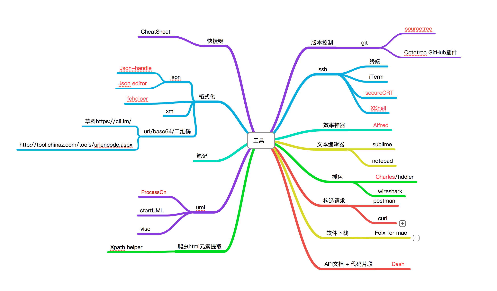

### 第一期分享

#### 分享主题：工具分享
#### 分享者：博文
##### 分享时间： 2019年6月20日（星期四）
工欲善其事必先利其器，好用的工具可以让工作的时候事半功倍；
博文哥对于一些自己好用的软件以及插件工具的介绍，期间大家也都对自己藏着掖着的一些好用的好玩的东西做了分享。 

[软件&工具包链接](https://pan.baidu.com/s/1ghFEA0cpyamzRHiVS4jrIQ)  
密码：请加我们QQ群或者微信索取

QQ群：695332013

微信：